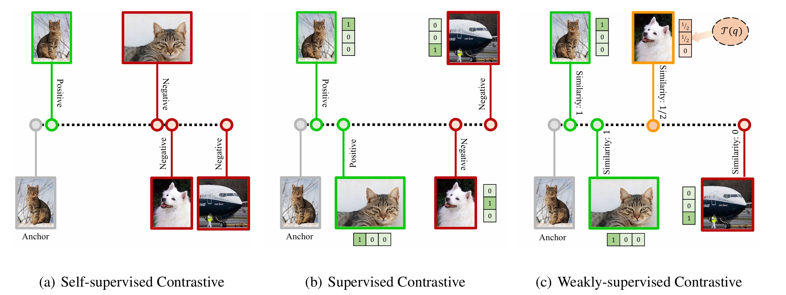
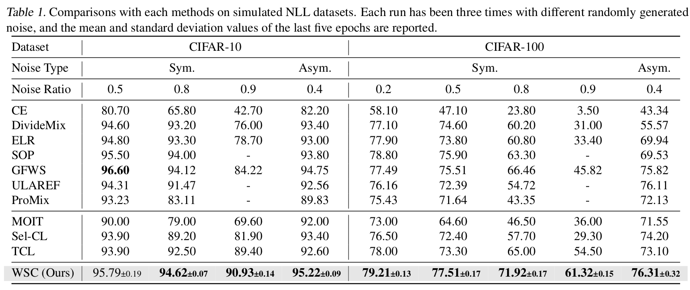
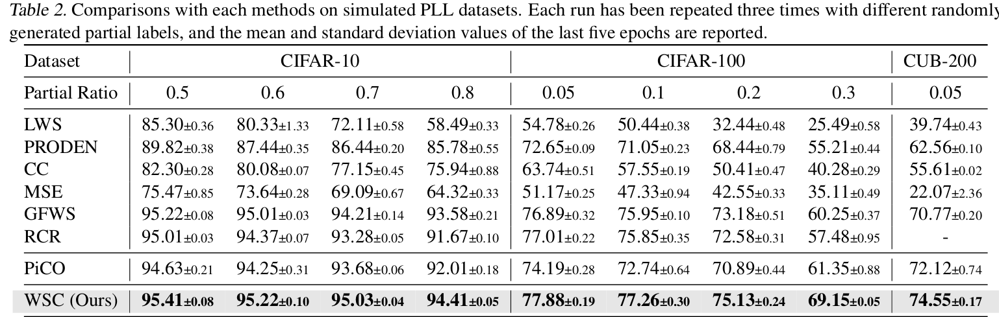

# Weakly-Supervised Contrastive Learning

This repository contains code for the paper "**Weakly-Supervised Contrastive Learning for Imprecise Class Labels**" (*Spotlight@ICML 2025*).



Based on the concept of "continuous semantic similarity", we propose a graph-theoretic framework for weakly-supervised contrastive learning, where semantic similarity serves as the graph weights. Our framework is highly versatile and can be applied to many weakly-supervised learning scenarios. We demonstrate its effectiveness through experiments in two common settings, i.e., noisy label and partial label learning (and more coming soon), where existing methods can be easily integrated to significantly improve performance.

<details>
  <summary>Table of Contents</summary>
  <ol>
    <li>
      <a href="#preparation">Preparation</a>
      <ul>
        <li><a href="#installation-of-packages">Installation of Packages</li>
        <li><a href="#preparation-of-datasets">Preparation of datasets</li>
      </ul>
    </li>
    <li>
      <a href="#training">Training</a>
      <ul>
      	<li><a href="#noisy-label-learning-(nll)">Noisy label learning (NLL)</a></li>
        <li><a href="#partial-label-learning-(nll)">Partial label learning (PLL)</a></li>
      </ul>
    </li>
    <li>
      <a href="#results">Results</a>
      <ul>
        <li><a href="#noisy-label-learning">Noisy label learning</a></li>
        <li><a href="#partial-label-learning">Partial label learning</a></li>
      </ul>
    </li>
	<li><a href="#citation">Citation</a></li>
    <li><a href="#acknowledgments">Acknowledgments</a></li>
  </ol>
</details>

## Preparation

### Installation of Packages

The code is tested with Python 3.8. To install the required packages, run:

```sh
pip install -r requirements.txt
```

### Preparation of datasets

For **CIFAR-10 / CIFAR-100**, they will be automatically downloaded. Inprecise labels are automatically generated by the code for sym / asym noise or instance-indepedent partial labels.

#### Noisy label datasets

- For **CIFAR-10n / CIFAR-100n**, you can head into [this website](http://ucsc-real.soe.ucsc.edu:1995/Download.html) to get the collected noisy labels.
- For Clothing1M, [this link](https://github.com/Newbeeer/L_DMI/issues/8) would help.

Note that for cifar10n / cifar100n, your data directory structure should look like:

```
data
├── cifar-10-batches-py
│   └── ...
├── cifar-100-python
│   └── ...
├── cifar10n
│   └── CIFAR-10_human.pt
└── cifar100n
    └── CIFAR-100_human.pt
```


#### Partial label datasets

```
data
├── cifar-10-batches-py
│   └── ...
├── cifar-100-python
│   └── ...
└── CUB-200-2011
    └── ...

```

## Training

Currently our codebase contains implementation of NLL and PLL. Following are some examples of training in different settings.

> [!TIP]
>
> Make sure replace `data_path` item at config files into your actual data path.

### Noisy label learning (NLL)

We conduct experiments on synthetic noise of CIFAR-10 and CIFAR-100, and practical noise of CIFAR-10N, CIFAR100N, Clothing1M.

```shell
CUDA_VISIBLE_DEVICES=0 python train_noisy.py --config_file configs/noisy_label/cifar100_sym_0.9.yaml
```

### Partial label learning (PLL)

We conduct experiments on uniform partial label of CIFAR-10, CIFAR-100 and cub200, and hierarchical partial label of CIFAR-100.
```shell
CUDA_VISIBLE_DEVICES=0 python train_partial.py --config_file configs/partial_label/cifar100_uniform_0.3.yaml
```

### Partial Noisy label learning (PNLL)
```shell
CUDA_VISIBLE_DEVICES=0 python train_mixture.py --config_file configs/partial_noise/cifar100_q_0.1_n_0.3.yaml
```

## Results

### Noisy label learning

### Partial label learning


Please refer to our paper (and appendix) for full results.

## Citation
Please cite us if you fine this project helpful for your project/paper:
```bibtex
@inproceedings{zhou2025WSC,
  title={Weakly-Supervised Contrastive Learning for Imprecise Class Labels},
  author={Zi-Hao Zhou and Jun-Jie Wang and Tong Wei and Min-Ling Zhang},
  booktitle={International Conference on Machine Learning},
  year={2025}
}
```


## Acknowledgments

We thanks the following codebase for the reference of our repo:

- [GFWS](https://github.com/Hhhhhhao/General-Framework-Weak-Supervision)
- [PLCR](https://github.com/wu-dd/PLCR)
